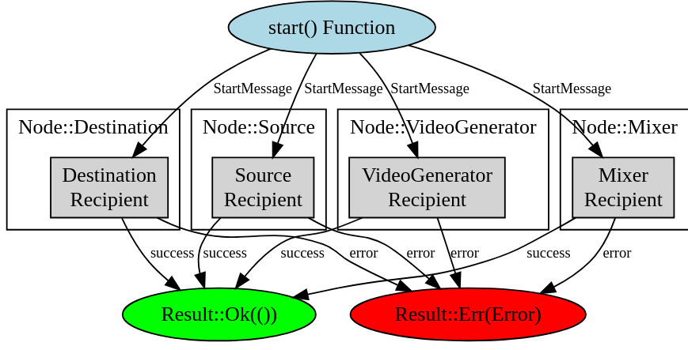

Let's walk through the code step by step using an example. We'll assume we have an instance of Node that could be one of several types, such as VideoGenerator, Source, Destination, or Mixer. Each of these types has an associated address (or actor reference) that allows communication with the actor that performs the role of that node.

Here's the example scenario:

1. Initialization: You have an instance of the Node enum, let's say it's a VideoGenerator node with an associated actor reference (address).


```let video_generator_addr: ActorRef<StartMessage> = /* some actor reference */;
let node = Node::VideoGenerator(video_generator_addr);```

2. Calling start Function: You want to start this node, so you call the start function on this instance and pass in a StartMessage.


```
let start_message = StartMessage { /* message contents */ };
let response_future = node.start(start_message);
```

3. Matching Node Type: Inside the start function, the first step is to determine what kind of node we're dealing with. This is done using a match expression on self, which is the instance of Node on which the start function was called.


```let recipient: Recipient<StartMessage> = match self {
    Node::VideoGenerator(addr) => addr.clone().recipient(),
    Node::Source(addr) => addr.clone().recipient(),
    Node::Destination(addr) => addr.clone().recipient(),
    Node::Mixer(addr) => addr.clone().recipient(),
};
```

4. Determining Recipient: In our example, the match expression will see that self is a Node::VideoGenerator. It will then execute the block of code associated with that case.


```
Node::VideoGenerator(addr) => addr.clone().recipient(),
```
5. Cloning Address: The addr variable holds the actor reference for the VideoGenerator. We call clone() on this address to create a copy of the actor reference. This is necessary because we might want to retain the original node and use it later without consuming it.

6. Getting Recipient: After cloning the address, we call recipient() on it, which is likely a method provided by the actor framework being used. This method transforms the actor reference into a Recipient which is a special object that can be used to send messages to the actor.

7. Sending Message: Now that we have the Recipient, the rest of the start function creates an asynchronous block of code that will send the StartMessage to the Recipient.


```Box::pin(async move {
    match recipient.send(msg).await {
        Ok(res) => res,
        Err(err) => Err(anyhow!("Internal server error {}", err)),
    }
})
```
8. Awaiting Response: The message is sent asynchronously using send(msg).await. If the actor successfully processes the message, it will return Ok(res), and if there is an error, it will return Err(err).
That's the step-by-step process of what happens when you call the start function on a Node. The actual execution of the node's starting process will depend on how the recipient actor is implemented and what it does when it receives the StartMessage.

